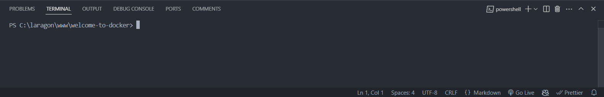
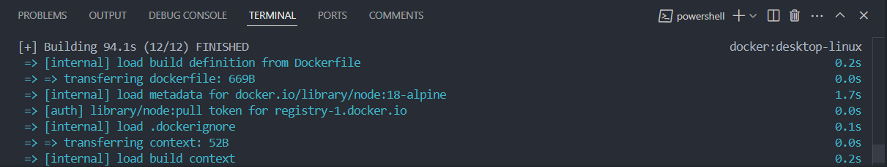
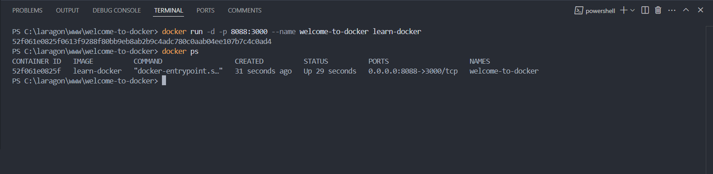
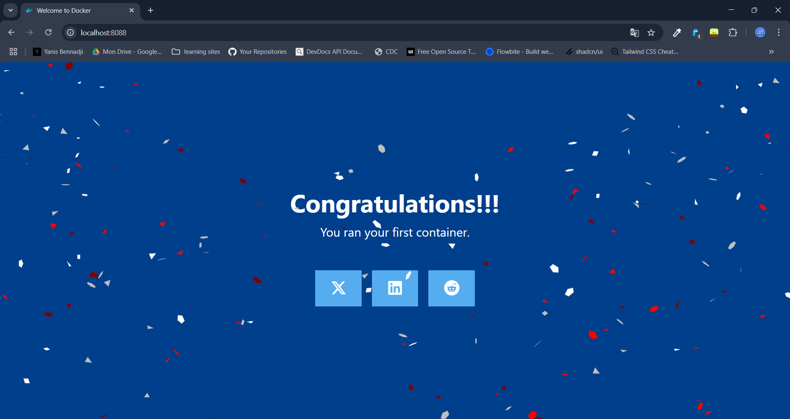
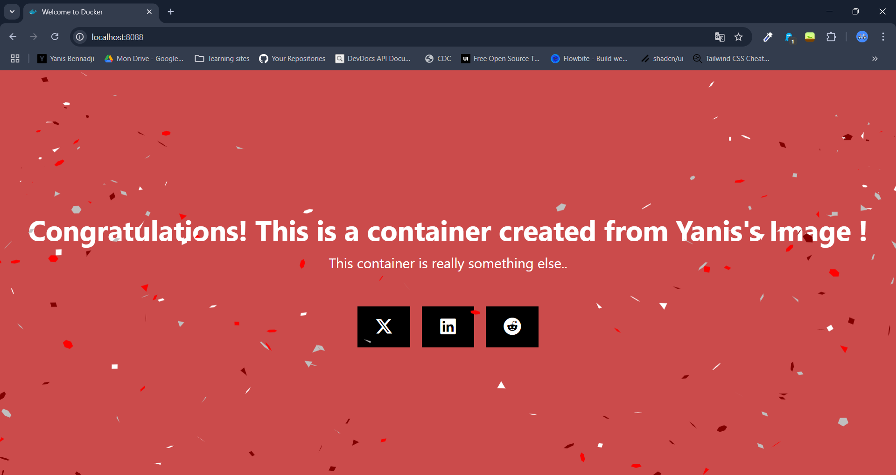
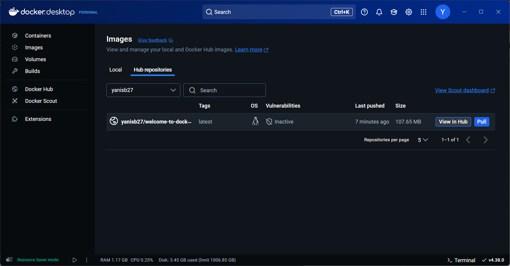
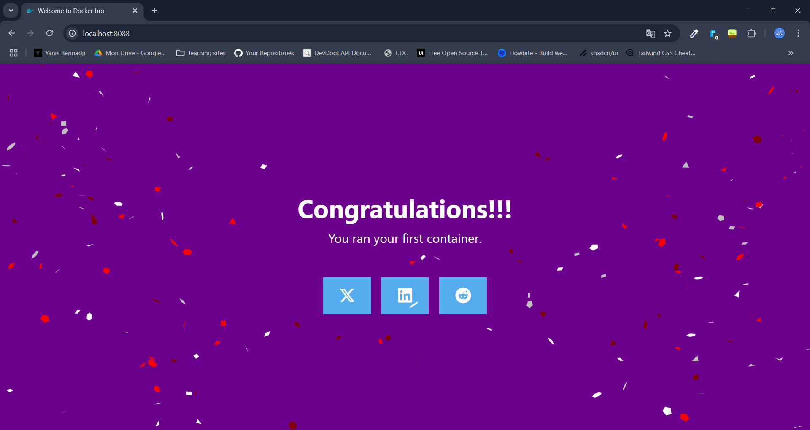
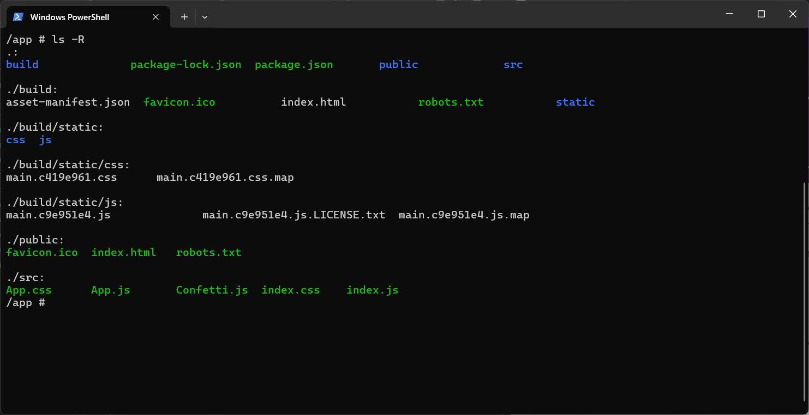
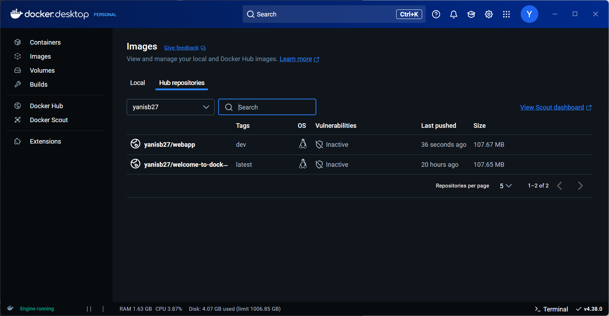

### 📦 Runtrack Docker Day 01 Job 02

* The goal here is to learn how to work with Docker using this repository :
  
https://github.com/docker/welcome-to-docker

Lets see now step by step how we are gonna do this.

* Start by cloning the repository
  
* Now you should be able to see the repository in VSCode like this :
  
  

  Take a look at the different files you have and you should find the `Dockerfile`. The next step is using this file to create an image that we will use with Docker.

  #### 🛠️ Lets build an image with a Dockerfile

* The first step is to open the VSCode terminal in our repository to make sur we are inside the right folder, our terminal should look like this : 



* Now lets build the image in the terminal with this command line :

```sh
docker build -t <name_of_the_image> .
```

In this command the `-t` flag is used to give a name to the image and the `.` at the end specifies the `build` context as the current directory to look for the Dockerfile. In this case I decided to call this image `welcome-to-docker`.

After using this command line you should see this : 



(It can take a bit of time to build, in my case it took 94.1s) and if we take a look at our Docker Desktop we can see that image is here :


* Lets run the image to make sure everything is right let's run this image by creating a container from it

We are gonna use this command line to create the container :

```sh
docker run -d -p 8088:3000 --name welcome-to-docker welcome-to-docker
```
And then use the next command to check if the container is running

```sh
docker ps
```




* Now let's check if we can check the container on our browser ! 

We are gonna go to this adress `localhost:8088` and if you followed the steps before correctly you should see this : 



Perfect ! Now lets see if we can change a bit this page so it feels a bit more personal.


#### 🎨 Lets change the code in VSCode so we can customize this page

Now, by looking at the different files available in our _welcome-to-docker_ folder, we can see in the _Dockerfile_ that our application is created from the _app.js_ file.

You can now make some changes in _app.js_ and _App.css_ to customize our application. However, after doing so, it seems that we have some issues—our changes are not being applied.

To fix this issue, we need to rebuild our image and container to update everything. Our current container is based on the previous version before the changes, so we are going to run the following commands:

```sh
docker build -t welcome-to-docker .
```

We run the exact same command to rebuild our image while keeping the same name. After doing this, it's time to remove our previous container and create a new one from our updated image:

```sh
docker rm -f welcome-to-docker
```

Now lets create the container again.

```sh
docker run -d -p 8088:3000 --name welcome-to-docker welcome-to-docker
```

Go back to `localhost:8088` to see the different changes ! 




#### 🌐 Let's publish this image so we can share it with people

We have our custom image that represents us. Now, the next step is to share it with others.

First, if you haven't already, log in to Docker using the following command:

```sh
docker login
```

Enter your DockerHub username and password.

When you are succesfully connected, we are gonna push our image to Docker hub using the following commands : 

```sh
docker tag <local-image-name> <dockerhub-username>/<repository-name>
```

After this one use : 

```sh
docker push <dockerhub-username>/<repository-name>
```

Don't forget to replace your username and the local image name with your own, and choose a repository name that suits your needs.

Now if you check your own DockerHub you should be able to see the image you have just published ! 



#### 🤝 Now let's pull, change and publish an image from someone

Now, we want to pull an image from someone else. In my case, I'm going to pull Arthur's image and create a container from it:

```sh
docker pull derroce/webapp:dev
```
```sh
docker run -d --name container1 -p 8088:3000 derroce/webapp:dev
```

If we now take a look at this container on our browser, it should look like this :



It's now time to make some changes to this image, but how? We don't have Arthur's local files on our computer, so let's copy them from the container!

The first step is to locate where the files are in the container. So, in the terminal, we are going to use these command lines:

```sh
docker exec -it container1 sh
```

It allows us to run a `bash` terminal in our previously created container, enabling us to execute commands inside it.

Now we want to locate where are the `App.js` and `App.css` files so we can copy them and change them so we use : 

```sh
ls -R
```




We can now see that our files are located in the /src folder so let's exit this bash terminal with `exit`.

We are back in our PowerShell, so let's copy the files now that we know where they are! Since we need two files, we are going to copy them using `docker cp`.

```sh
docker cp container1:/app/src/App.css ./src/App.css
```

```sh
docker cp container1:/app/src/App.js ./src/App.js
```

And now, if you take a look in your IDE, you should be able to see the files locally and modify them as needed.

Now we just have to build this image again and publish it on our Dockerhub with : 

```sh
docker build -t derroce/webapp:dev .
```

I'm gonna do a quick tag change so we can see that its my version (change it according to your username) : 

```sh
docker tag derroce/webapp:dev yanisb27/webapp:dev
```

Now lets publish it on Dockerhub : 

```sh
docker push yanisb27/webapp:dev
```

And it's done ! We have now published our image on Dockerhub ! 




