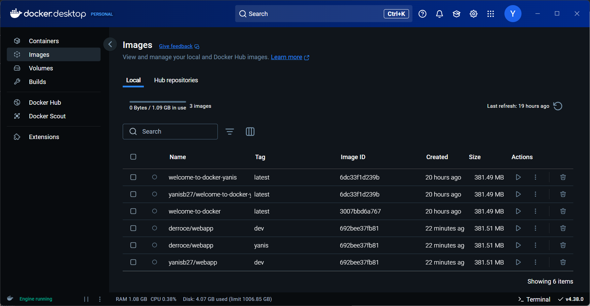
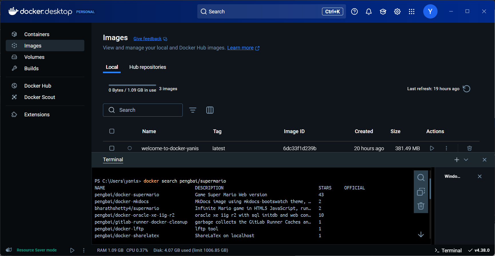
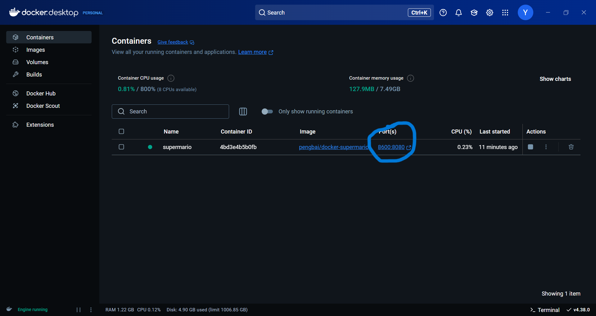
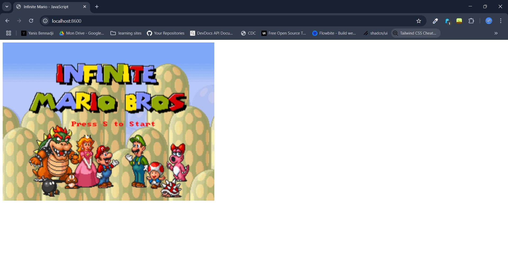
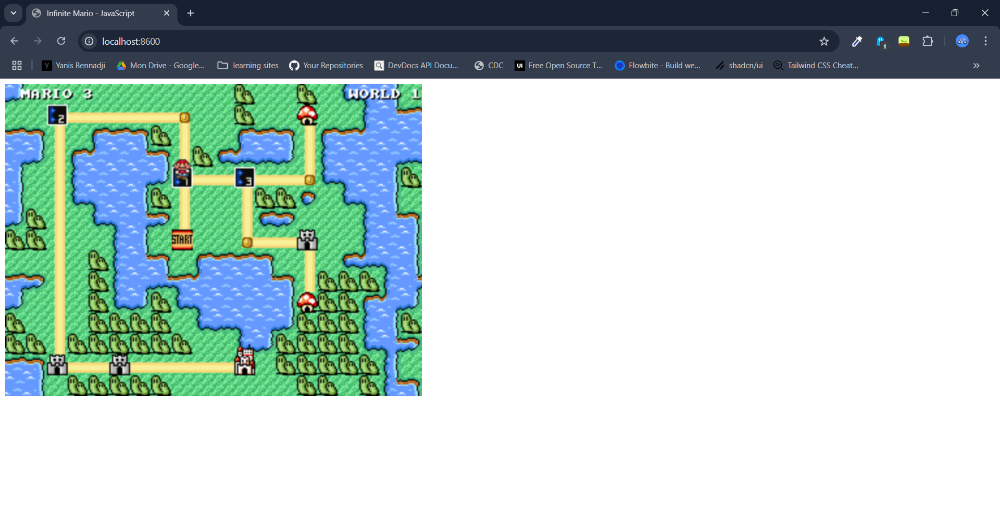
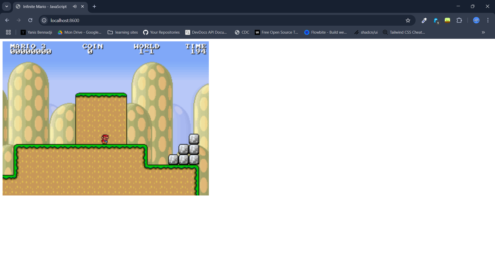
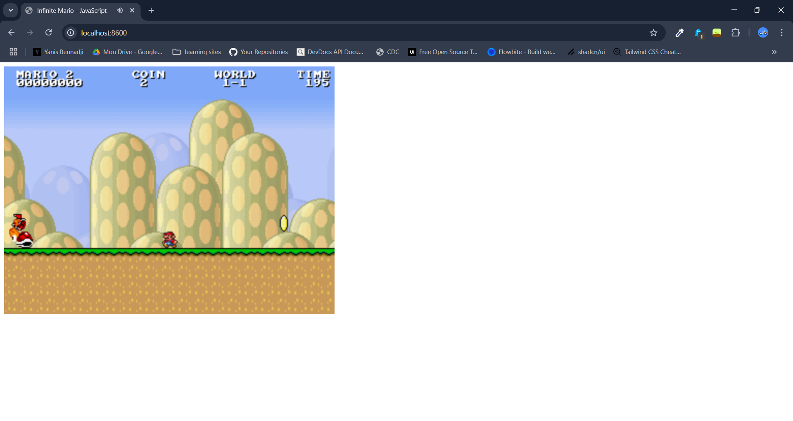

### 📦 Runtrack Docker Day 01 Job 03

* The goal in this Job is to learn how to learn more deeply the usage of Docker Desktop and how to use different images we can find online.


#### 🔎 Search an image with Docker Desktop

The first step is to open Docker Desktop, go insinde the "images" menu on the left side bar and access the terminal located at the bottom right of bottom Desktop.



Now that we have opened the terminal we are gonna look for an image called `pengbai/supermario` using the following command : 

```sh
docker search pengbai/supermario
```



Let's pull it so we can have it on our computer : 

```sh
docker pull pengbai/docker-supermario
```

You will notice after this that it appears on your Images list in Docker Desktop now.


#### 📦 Let's create a container from this now (and play a bit)

Now go to the "containers" menu on the left side bar and lets run a container, assign it the port 8600 on the 8080 in detached mode.

```sh
docker run -d --name supermario -p 8600:8080 pengbai/docker-supermario
```

Create another container with a different port right now, we will need it later.

```sh
docker run -d --name supermario2 -p 8700:8080 pengbai/docker-supermario
```

Now our container is running and it appears on Docker Desktop. We have two way to access it, first with the `localhost:8600` adress on our web browser, or by clicking on the port in Docker Desktop : 



And this should appear : 



You can now play Mario on your browser ! 







