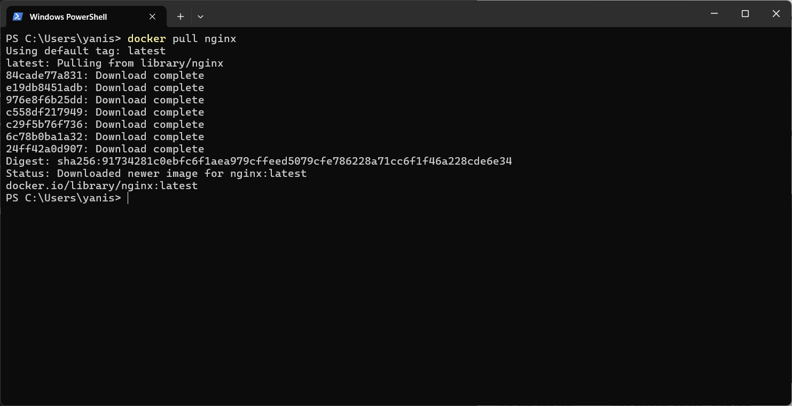
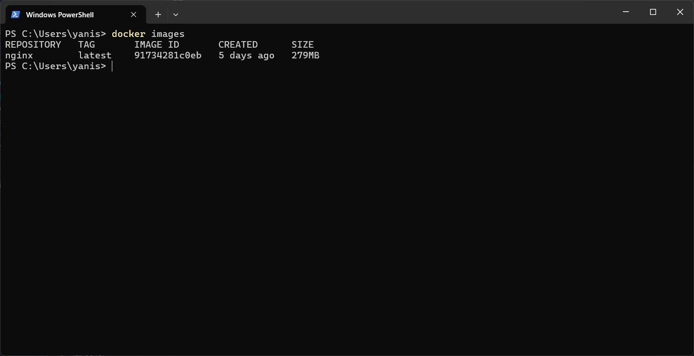

### 📦 Runtrack Docker Jour 01

* Vérifier la version de Docker : 
```sh
docker --version
```


* Tester les commandes de base : 

```sh
docker info
```


```sh
docker ps
```


```sh
docker images
```


```sh
docker run
```


```sh
docker stop
```


* Récupérer l'image Docker

```sh
docker pull
```
Dans ce cas la on va pull l'image `nginx` pour la suite.




```sh
docker images
```

On utilise cette commande de nouveau avec cette fois ci un résultat différent.

