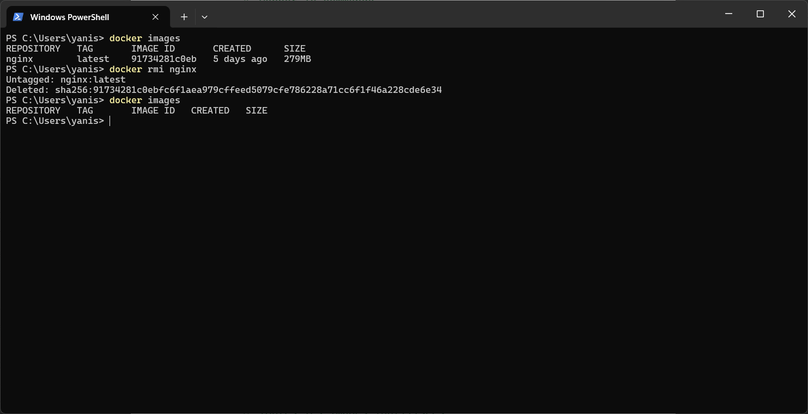

### 📦 Runtrack Docker Day 01

* Check Docker version : 
```sh
docker --version
```


* Testing basic commands : 

```sh
docker info
```


```sh
docker ps
```


```sh
docker images
```


```sh
docker run
```


```sh
docker stop
```


* Pull a Docker images

```sh
docker pull
```
In this case we are gonna pull `nginx` for the rest of the work.


```sh
docker images
```

We use this command again but this time with a different result.


* Create the Docker container 

We are gonna use the following command :

```sh
docker run -it --rm --name first-container -p 8080:80 nginx
```

This allows us to create a temporary nginx container.


We can see the result of this in Docker Desktop too.


If we want to access the container with a web browser we need to go to :
`localhost:8080`


* Stop your container 

Since our container is in interactive mode `-it`, we stop it using `CTRL+C` and it will delete automatically with `--rm`.

In the case where our container is in detached mode `-d`, we will need to use the following command : 

```sh
docker stop first-container
```


* Delete our container

In the case where our command dont contain `--rm` we must use the following command : 

```sh
docker rm first-container
```


Remember to stop your container before trying to delete it, if not you can force both the stop and the delete with the following command : 

```sh
docker rm -f first-container
```

* Delete the docker image

To be able to delete the `nginx` image, we must use this command :

```sh
docker rmi nginx
```



We can see that `nginx` was present before using this.

##### List of commands to be able to delete different things

* A specific container 

```sh
docker rm <container_id_or_name>
```

* Multiple container at once

```sh
docker rm <container_name_or_id1> <container_name_or_id2>
```

* All stopped containers

```sh
docker container prune
```

Example :


* Force the removal of an active container

When we want to force something, we usually add `-f` in the command line.

```sh
docker rm  -f <container_id_or_name>
```

* Delete a specific image 

```sh
docker rmi <image_name>
```


* Delete multiple images 

```sh
docker rmi <image_name1> <image_name2>
```

