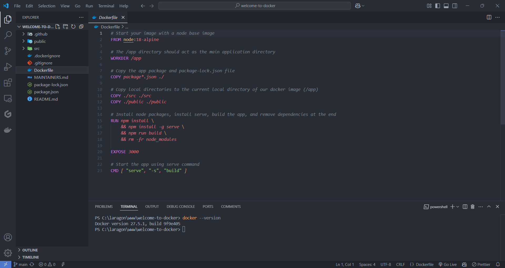
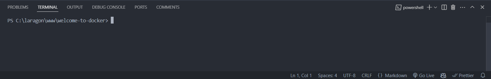

### 📦 Runtrack Docker Day 01 Job 02

* The goal here is to learn how to work with Docker using this repository :
  
https://github.com/docker/welcome-to-docker

Lets see now step by step how we are gonna do this.

* Start by cloning the repository
  
* Now you should be able to see the repository in VSCode like this :
  
  

  Take a look at the different files you have and you should find the `Dockerfile`. The next step is using this file to create an image that we will use with Docker.

  #### 🛠️ Lets build an image with a Dockerfile

* The first step is to open the VSCode terminal in our repository to make sur we are inside the right folder, our terminal should look like this : 

